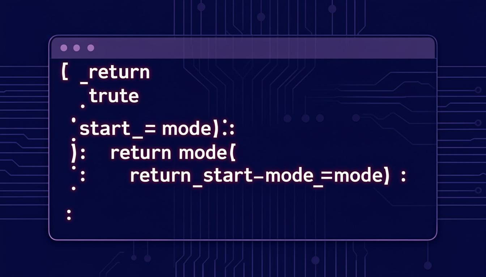

<div align="center">

# ⚡ CodeForge IDE

**A full-featured online compiler IDE powered by Google Gemini AI**

[](https://nextjs.org/)
[](https://www.typescriptlang.org/)
[](https://tailwindcss.com/)
[](https://ai.google.dev/)
[](https://opensource.org/licenses/MIT)



[Features](#-features) · [Tech Stack](#-tech-stack) · [Getting Started](#-getting-started) · [Configuration](#-configuration) · [Architecture](#-architecture) · [Contributing](#-contributing)

</div>

---

## ✨ Features

### 🖥️ IDE Experience
- **Monaco Editor** — VS Code-quality code editing with syntax highlighting, autocomplete, and multi-cursor support
- **Multi-language Support** — Python, JavaScript, TypeScript, C, C++, Java, and more
- **File Explorer** — Create, organize, and manage files and folders in a project tree
- **Editor Tabs** — Multiple file editing with tabbed interface
- **Dark / Light Theme** — Seamless theme switching with IDE-optimized color schemes
- **Keyboard Shortcuts** — Common IDE keybindings for efficient workflow

### 🚀 Code Execution
- **Real-time Code Execution** — Run code directly in the browser with live output
- **Integrated Terminal** — Full PTY terminal with WebSocket communication
- **Error Parsing** — Intelligent error detection and problem highlighting
- **Execution Timing** — Track code performance with execution time reporting

### 🤖 Gemini AI Assistant
- **Code Explanation** — Ask AI to explain any code snippet in plain English
- **Bug Fixing** — Get AI-powered debugging suggestions and fixes
- **Code Optimization** — Receive performance optimization recommendations
- **Test Generation** — Auto-generate comprehensive test cases
- **Code Refactoring** — Improve code quality with AI-driven refactoring
- **Free Chat** — Ask any programming question in natural language
- **Streaming Responses** — Real-time AI response streaming for instant feedback

### 🔐 Authentication & Security
- **User Authentication** — Sign up / Log in with secure password hashing (bcrypt)
- **JWT Sessions** — Stateless token-based authentication
- **API Key Protection** — Gemini API key stored server-side only, never exposed to client
- **Per-user File Storage** — Each user has their own isolated workspace

---

## 🛠️ Tech Stack

| Category | Technology |
|----------|------------|
| **Framework** | [Next.js 16](https://nextjs.org/) (App Router) |
| **Language** | [TypeScript 5](https://www.typescriptlang.org/) |
| **Styling** | [Tailwind CSS 4](https://tailwindcss.com/) + [shadcn/ui](https://ui.shadcn.com/) |
| **Editor** | [Monaco Editor](https://microsoft.github.io/monaco-editor/) (VS Code engine) |
| **AI** | [Google Gemini](https://ai.google.dev/) + z-ai-web-dev-sdk fallback |
| **Database** | [Prisma ORM](https://www.prisma.io/) with SQLite |
| **State** | [Zustand](https://zustand-demo.pmnd.rs/) + [TanStack Query](https://tanstack.com/query) |
| **Terminal** | [xterm.js](https://xtermjs.org/) + [node-pty](https://github.com/microsoft/node-pty) |
| **Real-time** | [WebSocket (ws)](https://github.com/websockets/ws) |
| **Auth** | [bcryptjs](https://github.com/dcodeIO/bcrypt.js) + [jsonwebtoken](https://github.com/auth0/node-jsonwebtoken) |
| **Animations** | [Framer Motion](https://www.framer.com/motion/) |

---

## 🚀 Getting Started

### Prerequisites

- **Node.js** >= 18
- **Bun** (recommended) or npm/yarn/pnpm
- **Python 3** (for Python code execution)
- **GCC** (for C/C++ code execution)
- **Java JDK** (for Java code execution)

### Installation

```bash
# 1. Clone the repository
git clone https://github.com/your-username/codeforge-ide.git
cd codeforge-ide

# 2. Install dependencies
bun install

# 3. Set up environment variables
cp .env.example .env
cp .env.local.example .env.local
```

Edit `.env` and `.env.local` to add your Gemini API key:

```env
# .env
DATABASE_URL=file:./db/custom.db
GEMINI_API_KEY=your_gemini_api_key_here

# .env.local
GEMINI_API_KEY=your_gemini_api_key_here
```

> 💡 Get your free Gemini API key from [Google AI Studio](https://aistudio.google.com/apikey)

```bash
# 4. Initialize the database
bun run db:push

# 5. Install terminal service dependencies
cd mini-services/terminal-service && npm install && cd ../..

# 6. Start the development server
bun run dev
```

Open [http://localhost:3000](http://localhost:3000) in your browser.

---

## ⚙️ Configuration

### Environment Variables

| Variable | Description | Required | Default |
|----------|-------------|----------|---------|
| `DATABASE_URL` | SQLite database file path | Yes | `file:./db/custom.db` |
| `GEMINI_API_KEY` | Google Gemini API key | Yes | — |

### Service Ports

| Service | Port | Description |
|---------|------|-------------|
| Next.js App | 3000 | Main web application |
| Terminal WebSocket | 3002 | PTY terminal service |
| Executor Service | 3001 | Code execution engine |

### AI Configuration

The AI Assistant uses a **hybrid fallback strategy**:

1. **Primary**: Google Gemini API (`gemini-2.0-flash`)
2. **Fallback**: z-ai-web-dev-sdk (automatic — used if Gemini is rate-limited or region-blocked)

The API key is **never exposed** to the client — all AI requests go through server-side API routes.

---

## 🏗️ Architecture

```
codeforge-ide/
├── src/
│   ├── app/
│   │   ├── api/
│   │   │   ├── ai/chat/          # Gemini AI chat endpoint
│   │   │   ├── auth/             # Authentication (login, signup, me)
│   │   │   ├── execute/          # Code execution API
│   │   │   ├── files/            # File CRUD operations
│   │   │   ├── folders/          # Folder management
│   │   │   └── validate/         # Code validation
│   │   ├── layout.tsx
│   │   ├── page.tsx              # Main IDE page
│   │   └── globals.css
│   ├── components/
│   │   ├── ide/
│   │   │   ├── AIAssistant.tsx   # Gemini AI chat panel
│   │   │   ├── ActivityBar.tsx   # Left icon sidebar
│   │   │   ├── AuthModal.tsx     # Login/Signup modal
│   │   │   ├── CodeEditor.tsx    # Monaco editor wrapper
│   │   │   ├── EditorTabs.tsx    # File tabs
│   │   │   ├── IDELayout.tsx     # Main IDE layout
│   │   │   ├── ProblemsPanel.tsx # Error/warning display
│   │   │   ├── Sidebar.tsx       # File explorer
│   │   │   ├── StatusBar.tsx     # Bottom status bar
│   │   │   ├── Terminal.tsx      # xterm.js terminal
│   │   │   └── Toolbar.tsx       # Top toolbar
│   │   └── ui/                   # shadcn/ui components
│   ├── hooks/                    # Custom React hooks
│   ├── lib/
│   │   ├── compiler/             # Custom compiler pipeline
│   │   │   ├── lexer/            # Lexical analysis
│   │   │   ├── parser/           # Syntax parsing
│   │   │   ├── semantic/         # Semantic analysis
│   │   │   ├── ir/               # Intermediate representation
│   │   │   ├── optimizer/        # Code optimization
│   │   │   ├── codegen/          # Code generation
│   │   │   ├── vm/               # Virtual machine
│   │   │   ├── engine/           # Execution engine
│   │   │   └── security/         # Sandboxing & security
│   │   ├── api.ts                # API client
│   │   ├── auth.ts               # Auth utilities
│   │   ├── completions.ts        # Code completions
│   │   ├── db.ts                 # Prisma client
│   │   ├── executor-client.ts    # Code execution client
│   │   └── validation.ts         # Code validation
│   └── store/
│       └── useIDEStore.ts        # Zustand state management
├── mini-services/
│   ├── terminal-service/         # WebSocket PTY terminal
│   └── executor-service/         # Code execution engine
├── prisma/
│   └── schema.prisma             # Database schema
├── server.ts                     # Custom Next.js server + WS
├── public/                       # Static assets
└── package.json
```

### Data Flow

```
User → Monaco Editor → Zustand Store → API Routes → Database
                                    ↓
                              Code Execution → Terminal Output
                                    ↓
                              Gemini AI → Streaming Response
```

---

## 🎯 Supported Languages

| Language | Execution | Syntax Highlight | AI Support |
|----------|-----------|-----------------|------------|
| Python | ✅ | ✅ | ✅ |
| JavaScript | ✅ | ✅ | ✅ |
| TypeScript | ✅ | ✅ | ✅ |
| C | ✅ | ✅ | ✅ |
| C++ | ✅ | ✅ | ✅ |
| Java | ✅ | ✅ | ✅ |
| HTML | — | ✅ | ✅ |
| CSS | — | ✅ | ✅ |
| JSON | — | ✅ | ✅ |
| Markdown | — | ✅ | ✅ |

---

## 🤝 Contributing

Contributions are welcome! Here's how you can help:

1. **Fork** the repository
2. **Create** a feature branch: `git checkout -b feature/amazing-feature`
3. **Commit** your changes: `git commit -m 'Add amazing feature'`
4. **Push** to the branch: `git push origin feature/amazing-feature`
5. **Open** a Pull Request

### Development Guidelines

- Follow the existing TypeScript strict typing conventions
- Use shadcn/ui components for UI elements
- Keep API keys server-side only (never use `NEXT_PUBLIC_` prefix for secrets)
- Write responsive, mobile-first CSS with Tailwind
- Test across browsers before submitting

---

## 📄 License

This project is licensed under the MIT License — see the [LICENSE](LICENSE) file for details.

---

## 🙏 Acknowledgments

- [Monaco Editor](https://microsoft.github.io/monaco-editor/) — The editor that powers VS Code
- [shadcn/ui](https://ui.shadcn.com/) — Beautifully designed UI components
- [Google Gemini](https://ai.google.dev/) — AI capabilities
- [xterm.js](https://xtermjs.org/) — Terminal emulator for the web
- [Next.js](https://nextjs.org/) — The React framework for the web

---

<div align="center">

**Built with ❤️ using Next.js, TypeScript, and Google Gemini AI**

</div>
